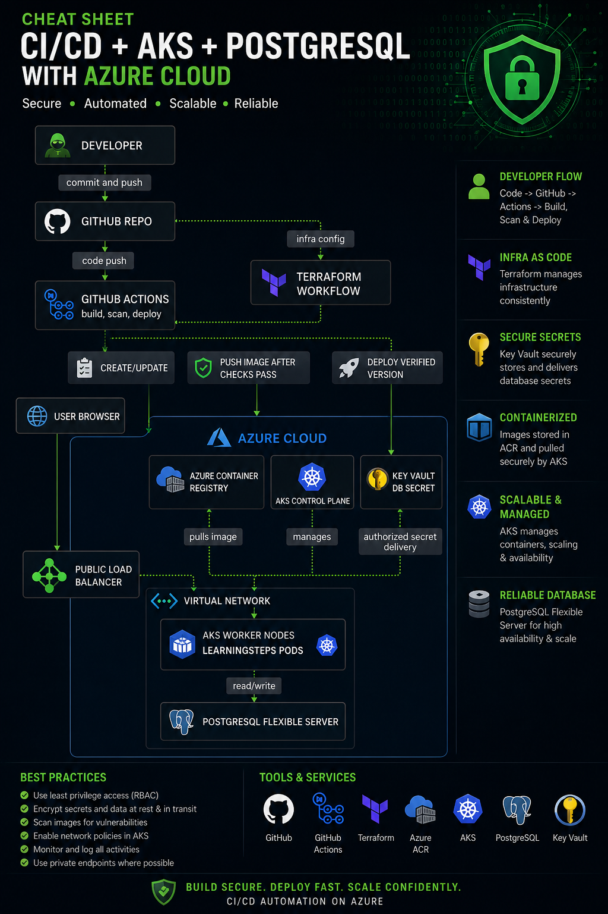

# LearningSteps Evolution

**From manual Azure deployment to automated DevSecOps.**

A FastAPI + PostgreSQL journal API, evolved from a hand-provisioned 2-tier Azure
setup into a fully automated, security-gated, self-healing deployment on Azure
Kubernetes Service — provisioned by Terraform, delivered by GitHub Actions, and
secured end to end.

[](https://github.com/Hany-Dh/learningsteps/actions)

> This repo is a fork of [CyberstepsDE/learningsteps](https://github.com/CyberstepsDE/learningsteps), evolved for Module 3 — Project 2.

---

## Architecture



Terraform provisions all infrastructure. GitHub Actions builds, scans, and
deploys the application via Helm on every push to `main`, authenticated to
Azure through passwordless OIDC — no stored cloud credentials.

| Layer | Technology |
|---|---|
| Application | Python, FastAPI, PostgreSQL |
| Containerization | Docker (multi-stage build) |
| Infrastructure as Code | Terraform (AzureRM provider) |
| Orchestration | Azure Kubernetes Service (AKS) + Helm |
| Secrets | Azure Key Vault + CSI Secrets Store driver |
| CI/CD | GitHub Actions (OIDC, no stored secrets) |
| Security scanning | Trivy (image + IaC), trufflehog (secrets) |
| Monitoring (optional) | Prometheus + Grafana |

Full design rationale, every issue hit, and all verification evidence is in
the [project report](docs/LearningSteps_Evolution_Report.pdf).

---

## Project Status

| Phase | Description | Status |
|---|---|---|
| 0 | Plan & architecture | ✅ Done |
| 1 | Tooling setup | ✅ Done |
| 2 | App working locally | ✅ Done |
| 3 | Dockerize + push to ACR | ✅ Done |
| 4 | Terraform infrastructure | ✅ Done |
| 5 | Key Vault secrets | ✅ Done |
| 6 | Helm deployment | ✅ Done |
| 7 | CI/CD (OIDC + security gates) | ✅ Done |
| 8 | Monitoring (optional) | ⏸️ Paused — infra proven, dashboard UI incomplete |
| 9 | Final demo | 📋 Planned — see report §10 |

---

## API

Six CRUD endpoints under `/entries`, accepting either `application/json` or
`text/plain`. Interactive docs at `/docs` once deployed.

```bash
curl -X POST http://<public-ip>/entries \
  -H "Content-Type: application/json" \
  -d '{"work":"Learned Kubernetes","struggle":"Networking","intention":"Practice more"}'
```

---

## Local Development

```bash
git clone https://github.com/Hany-Dh/learningsteps.git
cd learningsteps
python3 -m venv venv && source venv/bin/activate
pip install -r api/requirements.txt
cp .env-sample .env   # point DATABASE_URL at a local Postgres
cd api && uvicorn main:app --reload
```

Or with Docker:

```bash
docker compose up --build
```

---

## Cloud Deployment (summary)

1. **Install tooling** — `./install-tools-kali.sh` (Docker, Azure CLI, Terraform, kubectl, Helm, Trivy, trufflehog)
2. **Provision infrastructure** — `cd infra-terraform && terraform init && terraform apply`
3. **Store secrets** — DB connection string into Azure Key Vault, delivered via CSI driver
4. **Deploy** — `helm upgrade --install learningsteps ./learningsteps-chart`
5. **CI/CD** — every push to `main` builds, scans, and redeploys automatically

Full step-by-step commands: [`docs/LearningSteps_Evolution_Report.pdf`](docs/LearningSteps_Evolution_Report.pdf), Sections 5–7.

---

## Security

- No secret is ever committed to source control.
- Azure authentication uses OIDC federation — no stored cloud credential in GitHub.
- Every image is scanned (Trivy) and every commit is scanned for leaked secrets (trufflehog) before deploy.
- Key Vault network access defaults to deny.

---

## Documentation

- 📄 [Full project report (PDF)](docs/LearningSteps_Evolution_Report.pdf) — architecture, every phase, full troubleshooting log, security posture, final demo plan
- 📘 [Build guide](../learningsteps-devops-guide.md)

---

## License

Educational project — Module 3, Project 2, Cybersecurity Fundamentals course.
